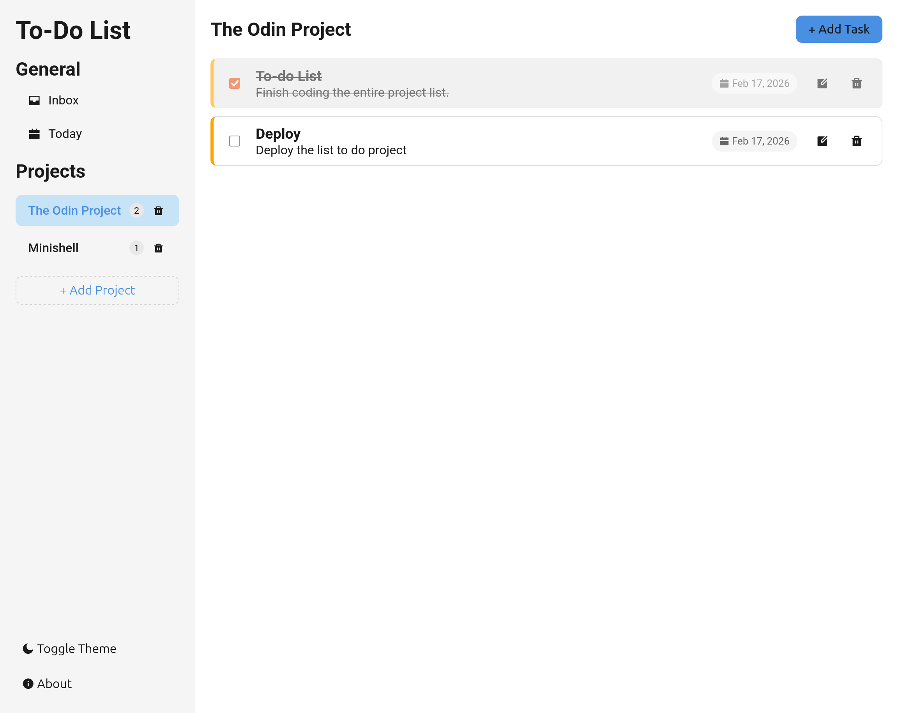
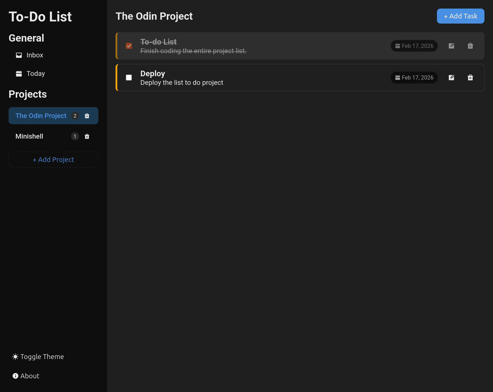

# 📝 To-Do List App

A clean and functional task management application built with vanilla JavaScript, following modular design principles. Developed as part of [The Odin Project](https://www.theodinproject.com/lessons/node-path-javascript-todo-list) curriculum.

---

## 🔴 Live Demo

> 🚧 **Coming soon** — will be available via GitHub Pages once deployed.

---

## 📸 Preview

| Light Theme | Dark Theme |
|-------------|------------|
|  |  |

---

## ✨ Features

- **Projects** — Organize your tasks into separate projects
- **Default Inbox** — A built-in Inbox project that cannot be deleted
- **Today View** — Quickly see all tasks due today across all projects
- **Task Management** — Create, edit, delete and complete tasks
- **Priority Levels** — Mark tasks as Low, Medium or High priority (color coded)
- **Due Dates** — Set due dates with formatted display
- **Dark / Light Theme** — Toggle between themes, saved automatically
- **Persistent Storage** — All data is saved to `localStorage`, surviving page refreshes

---

## 🗂️ Project Structure

```
src/
├── models/
│   ├── task.js            # Task class (title, description, dueDate, priority)
│   ├── project.js         # Project class (groups tasks)
│   └── project_manager.js # Central manager for all projects
├── utils/
│   └── storage.js         # localStorage load/save logic
├── ui/
│   ├── render.js          # DOM rendering functions
│   └── events.js          # Event listeners and handlers
├── styles/
│   └── style.css          # Styles with CSS variables for theming
└── index.js               # Entry point — initializes the app
```

---

## 🚀 Getting Started

### Prerequisites

Make sure you have [Node.js](https://nodejs.org/) installed.

### Installation

```bash
# 1. Clone the repository
git clone https://github.com/jormaedes/todo-list.git

# 2. Navigate into the project folder
cd todo-list

# 3. Install dependencies
npm install

# 4. Start the development server
npm start
```

The app will open at `http://localhost:8080` by default (via Webpack Dev Server).

### Build for Production

```bash
npm run build
```

The output will be in the `/dist` folder, ready to be deployed.

---

## 🛠️ Built With

| Technology | Purpose |
|---|---|
| HTML5 | Structure |
| CSS3 | Styling and theming (CSS variables) |
| JavaScript (ES6+) | Application logic |
| Webpack | Module bundler |
| [Remix Icon](https://remixicon.com/) | Icons |
| localStorage API | Data persistence |

---

## 📐 Architecture

The app follows a clear separation of concerns:

- **Models** (`task.js`, `project.js`, `project_manager.js`) — Handle all application logic. No DOM interaction.
- **Utils** (`storage.js`) — Handle saving and loading data from `localStorage`.
- **UI** (`render.js`, `events.js`) — Handle all DOM manipulation and user interactions.
- **Entry point** (`index.js`) — Bootstraps the app, loads data and wires everything together.

---

## 🔮 Future Improvements

- [ ] **Search bar** — Filter tasks in real time by title and description
- [ ] **Filter buttons** — Filter tasks by due date, or by completion status (completed / not completed)
- [ ] **Task counters** — Display the number of completed vs pending tasks per project and in total

---

## 👤 Author

Built by [Jormaedes](https://github.com/jormaedes) as part of [The Odin Project](https://www.theodinproject.com/) Full Stack JavaScript curriculum.

---

*Last updated: February 2026*